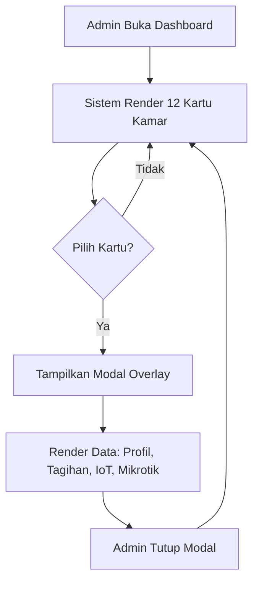
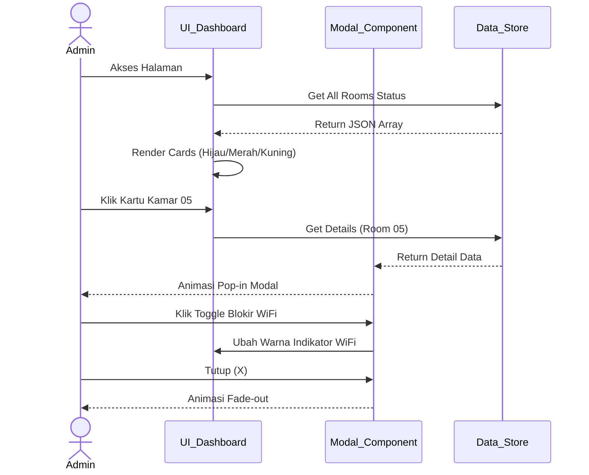
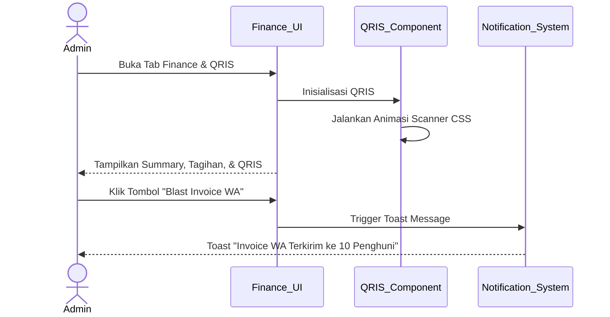
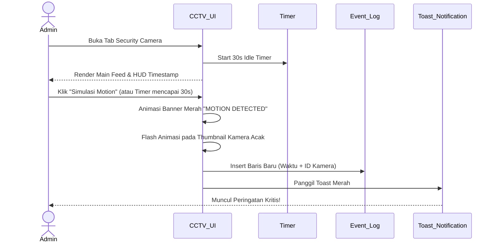
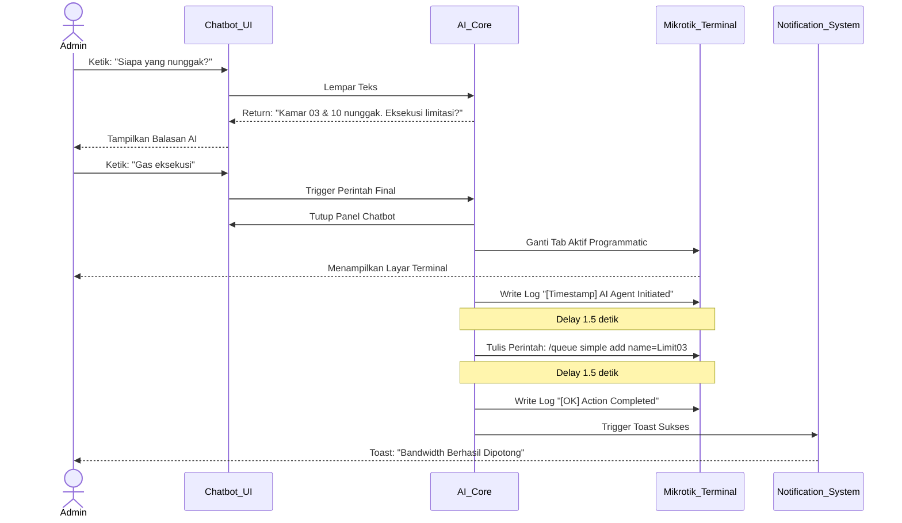
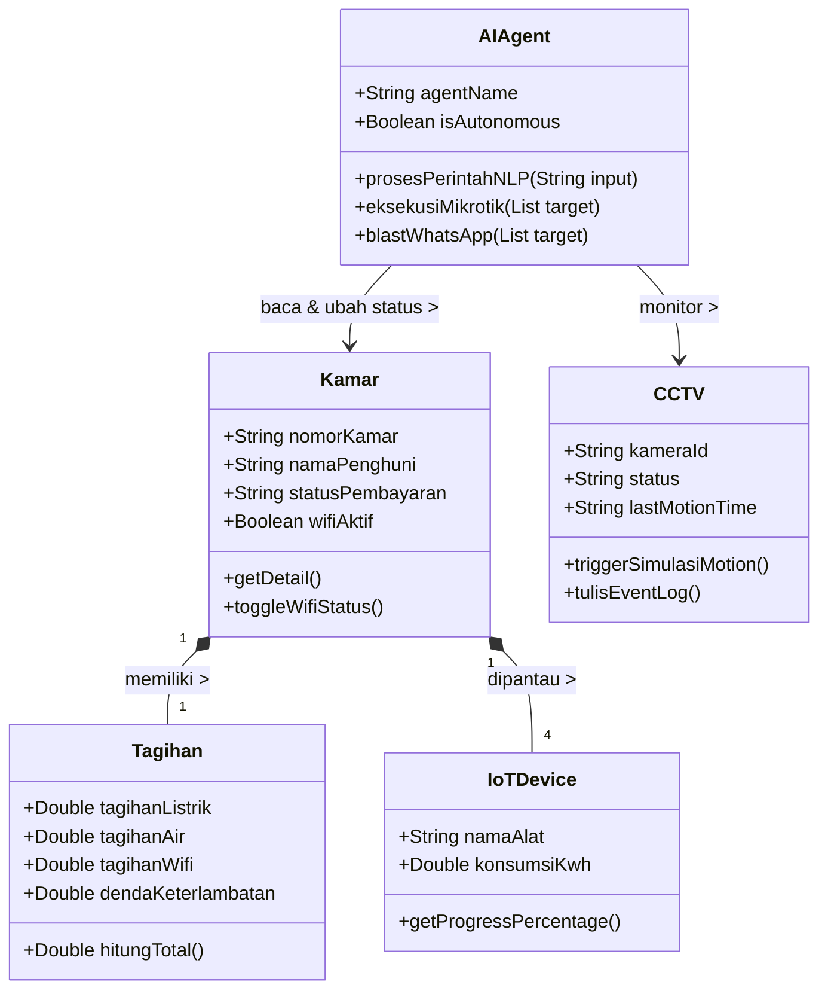

# Software Requirements Specification
## for
# KOSMATE AI — Smart Kost Management System

**Version 1.2.0 approved**

**Prepared by**
[NIM] — [Nama Anda]

---
*17 Juli 2026*

---

## 1. Riwayat Revisi Dokumen

| Name | Date | Reason For Changes | Version |
|---|---|---|---|
| [Nama Anda] | 2026-07-10 | Pembuatan dokumen awal berdasarkan rancangan sistem KosMate AI | 1.0.0 |
| [Nama Anda] | 2026-07-17 | Penyesuaian format SKPL mengikuti standar IEEE SRS, penambahan modul CCTV dan Grafik Keuangan | 1.1.0 |
| [Nama Anda] | 2026-07-17 | Penambahan Diagram (Class, Sequence, Activity), serta modul Tenants DB dan Agent Config | 1.2.0 |

---

## 2. Pendahuluan

### 2.1 Tujuan Penulisan Dokumen

Tujuan dari dokumen Spesifikasi Kebutuhan Perangkat Lunak (SKPL) ini adalah untuk memberikan deskripsi komprehensif dan mendetail tentang **KosMate AI — Smart Kost Management System**. Dokumen ini menjelaskan apa yang dilakukan oleh sistem (kebutuhan fungsional), bagaimana sistem harus berperilaku (kebutuhan non-fungsional), arsitektur teknis yang digunakan, serta model-model diagram yang menjadi pedoman dalam pengembangan, pengujian, dan pemeliharaan sistem. Dokumen ini mengikuti standar **IEEE 29148-2018** untuk rekayasa kebutuhan perangkat lunak.

### 2.2 Audien yang Dituju dan Pembaca yang Disarankan

Dokumen SKPL ini ditujukan kepada pemangku kepentingan berikut:

- **Tim Pengembang (Developer):** Sebagai acuan teknis dalam membangun fitur-fitur sistem, mulai dari arsitektur sistem agentic AI, desain antarmuka dashboard, hingga logika otomasi utilitas kos.
- **Manajer Proyek:** Untuk memantau ruang lingkup pengembangan, memperkirakan beban kerja, dan mengelola risiko teknis.
- **Tim Penguji (QA/Tester):** Sebagai dasar pembuatan skenario uji yang mencakup kebutuhan fungsional dan non-fungsional.
- **Pemilik Kos (Pengelola/Admin):** Sebagai referensi fitur-fitur yang akan tersedia dalam platform, khususnya terkait manajemen kamar, tagihan utilitas, dan sistem keamanan.
- **Pemilik Produk (Product Owner):** Sebagai acuan validasi bahwa semua fitur yang direncanakan sudah terdokumentasi dengan benar.

### 2.3 Batasan Produk

**KosMate AI** adalah sebuah aplikasi web berbasis *client-side* yang dirancang menggunakan pendekatan **Agentic AI Simulation** untuk mengelola operasional kos secara cerdas dan otomatis. Platform ini menargetkan siklus hidup manajemen kos secara menyeluruh:

- **Admin/Pemilik Kos** dapat memantau status seluruh kamar secara real-time, melihat rincian tagihan utilitas (listrik, air, WiFi) per kamar, memantau pemakaian daya IoT, menerima pembayaran via QRIS Dinamis, memblokir internet penghuni yang menunggak via Mikrotik RouterOS, dan memantau keamanan via CCTV.
- **AI Agent (KosMate)** beroperasi sebagai asisten otonom yang dapat merespons perintah natural language, mendeteksi penunggak secara otomatis, mengeksekusi limitasi bandwidth via SSH ke Router Mikrotik, dan mengirimkan notifikasi real-time kepada admin.
- Sistem CCTV mensimulasikan pemantauan 4 kamera keamanan secara bersamaan dengan fitur deteksi gerakan (motion detection) dan security event log.

Platform ini **TIDAK** mengintegrasikan koneksi SSH nyata ke perangkat Mikrotik; perilaku tersebut adalah simulasi agentic beresolusi tinggi untuk keperluan demonstrasi dan purwarupa.

Platform ini **TIDAK** mengintegrasikan payment gateway nyata (Xendit/Midtrans) pada versi purwarupa ini; sistem mensimulasikan alur pembayaran QRIS secara visual.

### 2.4 Definisi dan Istilah

| Istilah / Akronim | Definisi |
|---|---|
| Agentic AI | Paradigma kecerdasan buatan di mana sistem AI tidak hanya merespons, tetapi juga merencanakan dan mengeksekusi serangkaian tindakan secara otonom untuk mencapai tujuan tertentu. |
| Mikrotik RouterOS | Sistem operasi jaringan berbasis Linux yang digunakan pada perangkat router Mikrotik untuk mengelola bandwidth, firewall, dan koneksi internet. |
| SSH (Secure Shell) | Protokol kriptografi untuk komunikasi jaringan yang aman, digunakan untuk mengirim perintah ke router Mikrotik dari jarak jauh. |
| QRIS | Quick Response Code Indonesian Standard — standar kode QR nasional Indonesia yang memungkinkan pembayaran dari berbagai dompet digital dan mobile banking. |
| IoT (Internet of Things) | Ekosistem perangkat fisik yang terhubung ke internet dan dapat saling bertukar data; digunakan untuk memantau konsumsi energi per kamar. |
| Motion Detection | Teknologi pemrosesan gambar untuk mendeteksi perubahan atau pergerakan dalam frame video kamera keamanan. |
| Dashboard | Antarmuka visual terpusat yang menampilkan ringkasan data dan status sistem secara real-time dalam satu tampilan. |
| Token Listrik PLN | Sistem prabayar listrik Indonesia di mana konsumen membeli kredit listrik dalam satuan kWh sebelum dikonsumsi. |
| PDAM | Perusahaan Daerah Air Minum — penyedia layanan air bersih berlangganan bulanan di Indonesia. |
| Bandwidth Throttling | Teknik pembatasan kecepatan internet secara disengaja pada pengguna tertentu melalui konfigurasi router. |
| SKPL | Spesifikasi Kebutuhan Perangkat Lunak — dokumen yang mendefinisikan semua kebutuhan fungsional dan non-fungsional dari suatu perangkat lunak. |
| Chart.js | Pustaka JavaScript sumber terbuka untuk membuat grafik dan visualisasi data interaktif berbasis kanvas HTML5. |
| Glassmorphism | Tren desain UI yang menggunakan efek kaca buram (frosted glass) dengan latar belakang transparansi dan bayangan lembut. |
| Natural Language | Bahasa manusia sehari-hari (Bahasa Indonesia) yang digunakan sebagai medium perintah kepada AI Agent. |

### 2.5 Referensi

- Standar IEEE 29148-2018: Rekayasa sistem dan perangkat lunak — Proses siklus hidup — Rekayasa kebutuhan.
- Chart.js Documentation: https://www.chartjs.org/docs/
- Font Awesome 6 Documentation: https://fontawesome.com/docs
- Mikrotik RouterOS Wiki: https://wiki.mikrotik.com/wiki/Manual:API
- Xendit QRIS Documentation: https://developers.xendit.co/api-reference/
- MDN Web API — getUserMedia: https://developer.mozilla.org/en-US/docs/Web/API/MediaDevices/getUserMedia
- Google Fonts — Outfit & Plus Jakarta Sans: https://fonts.google.com
- IEEE SRS Template — digunakan sebagai acuan format dokumen ini.

---

## 3. Deskripsi Keseluruhan

### 3.1 Deskripsi Produk

**KosMate AI** adalah sistem manajemen kos cerdas berbasis web yang beroperasi sepenuhnya di sisi klien (*client-side*) menggunakan HTML5, CSS3, dan JavaScript ES2020+ murni. Sistem ini dirancang bukan sebagai aplikasi manajemen biasa, melainkan sebagai purwarupa (*prototype*) **Agentic AI** yang mendemonstrasikan bagaimana kecerdasan buatan dapat mengotomasi tugas-tugas operasional kos secara end-to-end.

**AI Agent (KosMate)** berfungsi sebagai asisten operasional yang dapat menerima perintah dalam bahasa natural melalui antarmuka chatbot, menganalisis situasi (siapa yang menunggak, berapa saldo listrik), dan secara otonom mengeksekusi tindakan korektif (memblokir internet via Mikrotik SSH, mengirim tagihan via WhatsApp, membeli token listrik via API).

Sistem ini mengintegrasikan **8 modul utama** dalam satu dashboard terpadu: Real-time Room Monitoring, Tenants DB, Finance & QRIS Payment, Graphic & Analytics, Security Camera (CCTV), Agentic Command Center, Mikrotik Core Terminal, dan Agent Configuration.

### 3.2 Fungsi Produk

Fungsi-fungsi utama yang ditawarkan oleh platform ini meliputi:

1. **Pemantauan Kamar Real-time:** Memantau status 12 kamar secara visual (Lunas/Nunggak/Pending) dalam format grid interaktif. Setiap kartu kamar dapat diklik untuk melihat detail lengkap penghuni dan tagihan.
2. **Manajemen Tagihan Utilitas Otomatis:** Sistem AI menghitung dan mendistribusikan tagihan listrik, air, dan WiFi per kamar berdasarkan pola pemakaian aktual mahasiswa, termasuk penerapan denda keterlambatan otomatis.
3. **Manajemen Data Penghuni (Tenants DB):** Tabel interaktif yang menampilkan daftar seluruh penghuni, status kamar, kontak, dan riwayat tunggakan, dilengkapi dengan filter dan pencarian real-time.
4. **Sistem Pembayaran QRIS Dinamis & Keuangan:** Integrasi antarmuka QRIS yang mensimulasikan alur pembayaran. Modul ini menyajikan ringkasan keuangan, rincian tagihan per komponen, dan riwayat pembayaran.
5. **Security Camera (CCTV) & Motion Detection:** Sistem pemantauan 4 kamera keamanan dengan fitur live timestamp, simulasi deteksi pergerakan otomatis, event log, dan kontrol kamera (snapshot, rekam).
6. **Agentic AI Chatbot:** Antarmuka percakapan natural language yang memungkinkan admin berinteraksi dengan sistem menggunakan bahasa sehari-hari. AI dapat mendeteksi penunggak dan mengeksekusi blokir internet secara otonom.
7. **Otomasi Mikrotik RouterOS:** Simulasi eksekusi perintah SSH ke router Mikrotik dengan terminal log yang menampilkan alur perintah *bandwidth throttling*.
8. **Grafik Analitik (Chart.js):** Visualisasi tren pendapatan patungan kos 6 bulan terakhir dengan animasi tooltip interaktif.
9. **Konfigurasi AI Agent:** Halaman pengaturan (settings) untuk mengubah perilaku otonom AI (sensitivitas motion, batas denda, otomasi Mikrotik).

### 3.3 Penggolongan Karakteristik Pengguna

Platform ini memiliki dua kategori pengguna utama dengan karakteristik dan hak akses yang berbeda:

| Kategori Pengguna | Tugas Utama | Hak Akses ke Aplikasi | Kemampuan yang Harus Dimiliki |
|---|---|---|---|
| Admin / Pemilik Kos | Memantau seluruh kamar, mengelola tagihan, memverifikasi pembayaran, mengawasi keamanan via CCTV, mengkonfigurasi aturan AI Agent. | Penuh (Read, Update semua modul): Dashboard, Tenants, Finance, Mikrotik, CCTV, Settings. | Kemampuan dasar menggunakan aplikasi web browser, memahami konsep dasar manajemen kos dan tagihan utilitas. |
| AI Agent (KosMate) | Memproses perintah natural language, mendeteksi anomali pembayaran, mengeksekusi perintah RouterOS, mengirim notifikasi. | Otonom: Membaca status kamar, mengakses terminal Mikrotik, memicu notifikasi, berpindah tab secara programatik. | Sistem otonom berbasis logika; tidak memerlukan intervensi manusia untuk operasi rutin. |

### 3.4 Lingkungan Operasi

Lingkungan operasi KosMate AI mencakup komponen sisi klien yang sepenuhnya mandiri:

- **Sisi Klien (Frontend):** Dibangun menggunakan HTML5, CSS3 (Vanilla CSS dengan CSS Variables), dan JavaScript ES2020+ (Vanilla JS). Menggunakan pustaka Chart.js dan Font Awesome 6. Berjalan secara optimal di browser modern pada berbagai perangkat (Desktop, Tablet, Mobile — Responsif).
- **Tidak Membutuhkan Server:** Aplikasi berjalan sebagai file statis yang dapat dibuka langsung dari sistem file lokal (`file://`) atau di-deploy ke hosting statis.
- **Persyaratan Koneksi Internet:** Dibutuhkan untuk memuat font dari Google Fonts, ikon dari Font Awesome CDN, dan gambar dari Unsplash. Fungsionalitas inti tetap bekerja dalam mode offline.

### 3.5 Batasan Desain dan Implementasi

- **Simulasi Agentic:** Semua tindakan "agentic" merupakan simulasi beresolusi tinggi yang mendemonstrasikan alur kerja dan arsitektur sistem, bukan koneksi nyata ke perangkat eksternal.
- **Penyimpanan Data:** Seluruh data disimpan di memori JavaScript (*in-memory state*) dan akan kembali ke kondisi awal saat halaman di-refresh. Tidak ada koneksi ke database eksternal.
- **Skalabilitas:** Arsitektur *client-side* membatasi jumlah data yang dapat diproses secara bersamaan. Untuk implementasi produksi, diperlukan migrasi ke arsitektur backend.

### 3.6 Dokumentasi Pengguna

Dokumentasi yang tersedia untuk pengguna KosMate AI mencakup:

- **README.md:** Panduan membuka aplikasi, deskripsi fitur utama, dan cara mendemokan setiap modul.
- **Panduan Demo Chatbot:** Daftar perintah yang dapat diketikkan ke AI Chatbot beserta respons yang diharapkan.
- **Walkthrough Presentasi:** Dokumen langkah-demi-langkah untuk mendemonstrasikan semua fitur utama kepada audiens.

---

## 4. Kebutuhan Antarmuka Eksternal

### 4.1 User Interfaces

Antarmuka pengguna KosMate AI dibangun dengan HTML5 dan CSS3 (Ultra-Modern Dark Pro Theme):

- **Sidebar Navigasi:** 6 item menu (Overviews, Tenants DB, Finance & QRIS, Mikrotik Core, Security Camera, Agent Config). Item aktif ditandai dengan gradasi biru-ungu.
- **Topbar:** Search bar, tombol notifikasi (lonceng), tombol pengaturan, dan profil pengguna.
- **Dashboard Overview:** 4 kartu statistik, grid kamar interaktif, dan grafik keuangan Chart.js.
- **Modal Detail Kamar:** Panel overlay memuat profil penghuni, rincian tagihan (listrik/air/WiFi/denda), IoT monitoring per perangkat, dan toggle blokir WiFi.
- **Finance & QRIS:** 4 summary card, rincian tagihan berbasis baris, riwayat pembayaran, dan QRIS card dengan animasi garis scanner.
- **Tenants DB:** Tabel data penghuni dengan input pencarian (search bar) dan label status.
- **Security Camera:** Main feed (420px), 4 thumbnail, HUD overlay (timestamp live), tombol kontrol, dan security event log.
- **AI Chatbot:** Panel mengambang dengan animasi float, input teks, dan tombol quick reply.
- **Toast Notifications:** Notifikasi pop-up *slide-in* berwarna sesuai jenis kejadian.

### 4.2 Hardware Interface

KosMate AI adalah aplikasi berbasis web sehingga tidak memiliki ketergantungan perangkat keras khusus selain perangkat dengan browser modern, minimal RAM 2GB, dan resolusi layar minimal 1280x720 piksel untuk tampilan dashboard yang optimal.

### 4.3 Software Interface

| Perangkat Lunak | Versi | Fungsi dalam Sistem |
|---|---|---|
| Browser Modern | Chrome 90+, Firefox 88+, Safari 14+ | Runtime utama aplikasi web |
| Chart.js | v4.x (via CDN jsdelivr) | Rendering grafik batang keuangan interaktif |
| Font Awesome | v6.4.0 (via CDN cdnjs) | Ikon vektor seluruh antarmuka sistem |
| Google Fonts | Outfit, Plus Jakarta Sans | Tipografi premium sistem |
| Unsplash CDN | URL-based | Gambar feed simulasi kamera CCTV |

### 4.4 Communication Interface

- **File Protocol (`file://`):** Untuk menjalankan aplikasi langsung dari sistem file lokal.
- **HTTPS (CDN Resources):** Untuk memuat aset eksternal (Chart.js, Font Awesome, Google Fonts, gambar) dari CDN publik.
- **JavaScript Event System:** Mekanisme komunikasi internal antar modul menggunakan DOM Events dan fungsi callback.

---

## 5. Functional Requirements

### Tabel Kebutuhan Fungsional

| ID | Kebutuhan Fungsional | Penjelasan |
|---|---|---|
| **FR-01** | **Pemantauan Kamar Real-time** | |
| FR-01.1 | Tampilkan Grid Kamar (UC-1) | Merender grid 12 kartu kamar dengan status berwarna: hijau (Lunas), merah (Nunggak), kuning (Pending). |
| FR-01.2 | Buka Detail Kamar via Modal (UC-1) | Menampilkan panel modal detail saat kartu diklik (profil, tagihan, IoT, Mikrotik). |
| **FR-02** | **Manajemen Tagihan Utilitas** | |
| FR-02.1 | Kalkulasi Tagihan & Denda (UC-2) | Menghitung tagihan Listrik/Air/WiFi + denda otomatis (Rp 25.000) untuk kamar "Nunggak". |
| FR-02.2 | IoT Energy Monitoring (UC-2) | Menampilkan konsumsi daya 4 perangkat (AC, Lampu, Charger, Magic Com) per kamar. |
| **FR-03** | **Finance & QRIS Payment** | |
| FR-03.1 | QRIS Card Animasi (UC-3) | Menampilkan kartu QRIS dengan animasi garis scanner bergerak otomatis. |
| FR-03.2 | Finance Summary & Riwayat (UC-3) | Menampilkan ringkasan keuangan dan riwayat 4 pembayaran terakhir. |
| **FR-04** | **Manajemen Data Penghuni (Tenants DB)** | |
| FR-04.1 | Tabel Data Penghuni (UC-4) | Menampilkan daftar seluruh penghuni dalam format tabel lengkap dengan search bar. |
| **FR-05** | **Security Camera (CCTV)** | |
| FR-05.1 | Navigasi Feed & HUD (UC-5) | Main feed besar + 4 thumbnail samping. HUD menampilkan timestamp real-time. |
| FR-05.2 | Simulasi Motion Detection (UC-5) | Simulasi manual/otomatis (30s) memicu banner peringatan, thumbnail merah, dan event log. |
| **FR-06** | **AI Chatbot — Agentic Command Center** | |
| FR-06.1 | Pemrosesan NLP (UC-6) | Mengenali kata kunci (nunggak, cctv, listrik, gas eksekusi) dari input teks admin. |
| FR-06.2 | Eksekusi Otonom (UC-6) | AI secara otonom berpindah tab ke Mikrotik dan mengeksekusi blokir WiFi. |
| **FR-07** | **Terminal Mikrotik & Config** | |
| FR-07.1 | Log Terminal SSH (UC-7) | Terminal mencatat perintah & respons eksekusi RouterOS dengan format kode warna. |
| FR-07.2 | Agent Configuration (UC-8) | Halaman settings untuk mengatur parameter otonomi AI (batas denda, trigger). |

---

### 5.1 Use Case Diagram

```mermaid
usecaseDiagram
    actor Admin
    actor AIAgent

    Admin --> (UC-1: Pantau Status Kamar)
    Admin --> (UC-2: Kelola Tagihan & IoT)
    Admin --> (UC-3: Transaksi QRIS & Finance)
    Admin --> (UC-4: Kelola Data Penghuni)
    Admin --> (UC-5: Pantau Keamanan CCTV)
    Admin --> (UC-8: Konfigurasi AI Agent)
    
    AIAgent --> (UC-6: Proses Perintah Bahasa Natural)
    AIAgent --> (UC-7: Eksekusi Throttling Mikrotik)
    
    (UC-6: Proses Perintah Bahasa Natural) .> (UC-7: Eksekusi Throttling Mikrotik) : includes
```

---

### 5.2 Pemantauan Kamar Real-time (UC-1)

#### 5.2.1 Deskripsi Use Case
Admin memantau status seluruh kamar (12 kamar) secara visual dalam grid interaktif. Kartu kamar dapat diklik untuk membuka modal rincian tagihan, informasi penghuni, dan kontrol IoT/WiFi.

#### 5.2.2 Activity Diagram



#### 5.2.3 Sequence Diagram



---

### 5.3 Manajemen Tagihan & Keuangan QRIS (UC-2 & UC-3)

#### 5.3.1 Deskripsi Use Case
Sistem menghitung tagihan secara dinamis, mengaplikasikan denda otomatis, dan menyajikan antarmuka pembayaran QRIS Dinamis. Admin dapat mengirim *blast invoice* via WhatsApp.

#### 5.3.2 Sequence Diagram



---

### 5.4 Tenants DB & Agent Configuration (UC-4 & UC-8)

#### 5.4.1 Deskripsi Use Case
- **Tenants DB:** Admin melihat keseluruhan data penghuni dalam bentuk tabel (*spreadsheet-like*). Data mencakup kontak darurat, tanggal masuk, dan sisa kontrak.
- **Agent Configuration:** Admin mengatur seberapa independen AI Agent boleh beroperasi (contoh: *Auto-throttle* saat nunggak 3 hari, sensitivitas *motion detection*).

---

### 5.5 Security Camera — CCTV (UC-5)

#### 5.5.1 Deskripsi Use Case
Antarmuka CCTV profesional dengan 1 main feed dan 4 thumbnail. Sistem mensimulasikan motion detection otomatis setiap 30 detik atau via tombol manual, mencatat kejadian di log keamanan.

#### 5.5.2 Sequence Diagram



---

### 5.6 AI Chatbot — Agentic Command Center (UC-6 & UC-7)

#### 5.6.1 Deskripsi Use Case
AI memproses perintah bahasa sehari-hari. Berbeda dengan chatbot biasa, KosMate AI dapat berpindah tab dan mengeksekusi sistem (seperti terminal Mikrotik) tanpa bantuan manusia.

#### 5.6.2 Sequence Diagram (Alur Agentic Mikrotik)



---

### 5.9 Class Diagram

Diagram kelas di bawah menunjukkan pemodelan objek internal *in-memory state* yang digunakan oleh JavaScript untuk menjalankan simulasi:



---

## 6. Non-Functional Requirements

| ID | Parameter | Deskripsi Kebutuhan | Prioritas |
|---|---|---|---|
| NFR-01 | Availability (Ketersediaan) | Aplikasi harus dapat diakses setiap saat karena berjalan sepenuhnya di browser tanpa ketergantungan server backend. | Tinggi |
| NFR-02 | Reliability (Keandalan) | Sistem harus mampu menyelesaikan skenario eksekusi Agentic (Chatbot → Mikrotik → Notifikasi) tanpa *JavaScript runtime error*. Harus *null-safe*. | Tinggi |
| NFR-03 | Ergonomy (Kemudahan Penggunaan) | Navigasi antar tab menggunakan animasi transisi CSS halus. Semua tombol interaktif wajib memiliki *hover effect* (translateY/glow). | Sedang |
| NFR-04 | Portability (Portabilitas) | Berjalan di Chrome, Firefox, Safari, Edge (Desktop/Mobile) tanpa modifikasi. Menggunakan standar ES2020+. | Tinggi |
| NFR-05 | Performance / Response Time | Transisi halaman <= 500ms. Chart.js render <= 300ms. Timestamp HUD CCTV di-update tanpa lag setiap 500ms (requestAnimationFrame/setInterval). | Tinggi |
| NFR-06 | Visual Aesthetics (Estetika Visual) | Tema Ultra-Modern Dark Pro (*Background* `#070b14`, aksen neon *Blue* `#3b82f6` & *Purple* `#8b5cf6`). Komponen menggunakan CSS *Glassmorphism* (backdrop-filter). | Tinggi |
| NFR-07 | Interactivity (Interaktivitas) | Setiap aksi DOM merespons <= 150ms. Animasi wajib diakselerasi GPU (`transform` & `opacity`). | Tinggi |
| NFR-08 | Bahasa | Antarmuka, pesan sistem, dan notifikasi UI menggunakan Bahasa Indonesia. Logika koding dan *console log* dalam Bahasa Inggris. | Sedang |

---

*Dokumen SKPL ini disiapkan sebagai bagian dari Tugas Akhir Mata Kuliah Rekayasa Perangkat Lunak.*

*KosMate AI v1.2.0 — Smart Kost Management System berbasis Agentic AI*

*(c) 2026 — Semua Hak Dilindungi*
